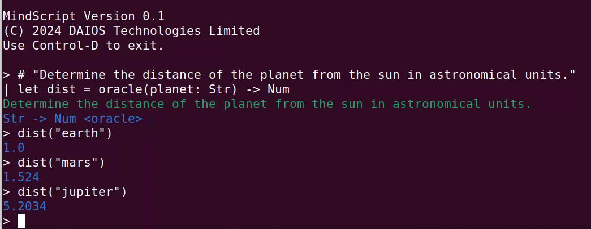

# MindScript

An experimental programming language combining formal and informal computation.

&copy; 2024 DAIOS Technologies Limited



## Table of Contents
<ul>
<li><a href="#description">Description</a></li>
<li><a href="#quickstart">Quickstart</a></li>
<li><a href="#basics">Basics</a></li>
<li><a href="#operators">Operators</a></li>
<li><a href="#functions">Functions</a></li>
<li><a href="#control-structures">Control structures</a></li>
<li><a href="#destructuring">Destructuring</a></li>
<li><a href="#types">Types</a></li>
<li><a href="#formal-types">Formal types</a></li>
<li><a href="#informal-types">Informal types</a></li>
<li><a href="#oracles">Oracles</a></li>
</ul>

## Description

MindScript is a programming language with both formal and informal
computation as first class citizens. 

MindScript's unique feature is its support of both formal and informal types.
Types constrain the values that an expression can take, however, formal types
impose constraints that can be deduced (via computation), while informal types
impose inductive constraints which guide the evaluation of an expression using
a black-box process (much like our own thought process).

Formal computation is implemented as a Turing-complete programming language (&lambda;),
whereas informal evaluations are obtained by consulting an oracle, implemented
as a large language model (&Psi;).

**Features:**

- Implements an [oracle machine](https://en.wikipedia.org/wiki/Oracle_machine).
- Minimal C-like/JavaScript/Lua syntax on top of JSON data types.
- Everything is an expression.
- Dynamically typed with runtime type checking.
- Code comments are semantic type annotations.
- (Current version) implemented in Python.


**Applications:**

- Processing of unstructured information
- Language model agents
- Semantic web
- and much more.

**Requirements:**

- Tested with Python 3.9

**Disclaimer:**

This is a strictly experimental programming language. The implementation is not guaranteed
to be correct, nor does it aim to be efficient. If there's enough traction, a C runtime
will follow.

## Quickstart

To run the REPL, enter
```
> python mindscript.py
```

To run a program `myprogram.ms`, enter
```
> python mindscript.py myprogram.ms
```

## Basics

MindScript is dynamically typed: only the values have a type, not the variables.

```
let greeting = "Hello, world!"

```

This defines a variable named `greeting` containing a value `Hello, world!` of type `Str`.

Everything is an expression. For instance, all of the following expressions evaluate
to `42`:

```
42
(40 + 2)
print(42)
let my_variable = 42
```

Variables are lexically scoped. The following code
```
let a = "outer a"
let b = "outer b"

do
    let a = "inner a"
    print(a)
    print(b)
end

print(a)
print(b)
```
outputs
```
inner a
outer b
outer a
outer b
```
as the declaration of the variable `a` inside the block
shadows the outer variable named `a`.


### Operators

Most of the usual operators are available and they have the expected precedence rules:

```
= + - * / % == != < <= > >= not and or
```

Types aren't cast automatically, and applying an operator to values having incompatible
types will lead to runtime errors. 

### Functions

Functions are defined the `fun` keyword. This builds a lambda expression, hence the
functions are anonymous. Functions can have one of more arguments and they can be
typed. 

As an example, consider the factorial function:

```
let factorial = fun(n: Int) -> Int do
    if n==0 then 
        0
    else
        n * factorial(n - 1)
    end
end
```

Note that:
- The arguments and the output can have a type annotation. Omitted types are assumed
  to be equal to `Any`.
- If no argument is provided in the function declaration, the a `null` argument
  is added automatically.
- The body of the function is enclosed in a `do ... end` block containing
  expressions. The function returns the value of the last expression,
  unless an explicit `return([VALUE])` expression is provided.

Functions are curried. Thus, the function
```
let sum = fun(n: Int, m: Int) -> Int do
    return(n + m)
end
```

has type `Int -> Int -> Int`, that is, arguments are consumed one-by-one, 
producing intermediate functions as results, and the following works:
```
> sum(1, 3)
4

> let add_one = sum(1)
fun(m: Int) -> Int

> add_one(3)
4

> sum(1)(3)
4
```

### Control structures

There are only three control structures in MindScript:
- logical expressions
- if-then expressions
- for-loop expressions
- (there are no while loops)

**Logical expressions** are short-circuited: as soon as the truth value is
known, the remaining subexpressions are not evaluated. For instance:
```
(2/1 == 1) or (2/2 == 1) or (2/3 == 2)
```
will only evaluate up to `(2/2 == 1)`, omitting the evaluation of `(2/3 == 2)`.

**If-then** expressions have a simple `if ... then` block structure with the
familiar semantics:
```
if n == 1 then
    print("The value is 1.")
elif n == 2 then
    print("The value is 2.")
else
    print("The value is unknown.")
end
```

**For-loops** come in three forms: iteration over the elements of an *array*,
over the key-value pairs of an *object*, and over the outputs of
an *iterator* (see below). The entire for-loop evaluates to the last evaluated
expression, i.e. as if the executions of its body are concatenated.
```
for v in [1, 2, 3] do
    print(v)
end

for [key, value] in {"x": 1, "y": 2, "z": 3} do
    print("(key, value) = " + str(key, value))
end

for v in iter do
    print(v)
end
```

An iterator is a "function" of type `Null -> Any` that generates a sequence
of values. These are typically implemented using closures. The for loop will
repeatedly call an iterator `iter` as `iter()` until it returns a `null` value.

In addition, the flow of execution can be modified through
- `continue( expr )`, which evaluates to `expr` and initiates the next iteration,
- `break( expr )`, which evaluates to `expr` and exits the entire for-loop.

### Destructuring

Destructuring assignments is a syntax that permits unpacking the members of
an array or the properties of an object into distinct values.

```
[let x, let y] = [2, -3, 1]
```
After this assignment, `x == 2` and `y == -3`. The third element `1` gets ignored.

```
{name: let n, email: let e} = {id: 1234, email: "albert@einstein.org", name: "Albert"}
```
After this assignment, `n == "Albert"` and `e == "albert@einstein.org"`. The
property `id` gets ignored.

These can be arbitrarily nested.

## Types

### Formal types

The primitive built-in data types are:
- `Null`: the `null` value;
- `Bool`: booleans, either `true` or `false`;
- `Int`: integers like `42`;
- `Num`: floating-point numbers like `3.1459`;
- `Str`: strings, enclosed in double- or single quotes as in `"hello, world!"` or `'hello, world!'`;
- `Type`: the type of a type.

In addition, there are container types:
- `Array`: arrays, as in `[1, 2, 3]`;
- `Object`: objects or dictionaries, as in `{name: "Albert Einstein", age: 76}`;
- `Fun`: function objects;
- `Any`: an arbitrary type.

The `typeof` function returns the type of a given expression:

```
> typeof({name: "Albert Einstein", age: 76})

{ name: Str, age: Int }

> typeof(print)

Any -> Any

> typeof(typeof)

Any -> Type
```

### Custom formal types

New types are built using the `type` keyword followed by a *type expression*:
```
let Person = type {
    name!: Str,
    email!: Str?,
    age: Int,
    hobbies: [Str]
}
```
Once created, they can be used as a normal MindScript values of type `Type`:
```
> typeof(Person)
Type

> issubtype({name: "Albert", email: null}, Person)
true
```

Notes:
- Primitive types: The primitive types are `Bool`, `Int`, `Num`, and `String`.
- The container types are built using delimiters `[...]` (arrays) or `{...}` (objects) 
  and then further specifying the types of their members. If the members are arbitrary,
  use `Array` and `Object` instead.
- Similarly, function types are indicated by an arrow `->` as in `(Int -> Str) -> Str`.
  To indicate an arbiraty functional structure, use `Fun`.
- You can omit the quotes/double-quotes of keys if they follow the naming convention
  of variable names.
- Mandatory object properties are indicated using `!`. Hence, `name!: Str` is a required
  property, whereas `name: Str` isn't.
- Optional elements (i.e. can have `null`) are indicated using `?`. Thus, `Str?` is
  either equal to a string or `null`, whereas `Str` can only be a valid string.

## Informal types

A value can be annotated with an explanatory comment, which becomes its informal
type. Informal types do not have well-defined semantics, but they influence their
evaluation by the oracle (see the section on oracles). Comments are created by
the annotation operator `#` which attaches a string to the value of the following
expression: 

```
# "The speed of light in meters per second."
let c = 299792458
```

Since the annotation gets attached to the value of the expression, the following
code will produce a function of informal type "Computes the sum of two integers."
```
# "Computes the sum of two integers."
let sum = fun(n: Int, m: Int) -> Int do
    n + m
end
```

Likewise, this allows annotating type expressions:
```
let Person = {
    # "The name of the person."
    name!: Str,
    
    # "The age of the person."
    age: Int
}
```

## Oracles


